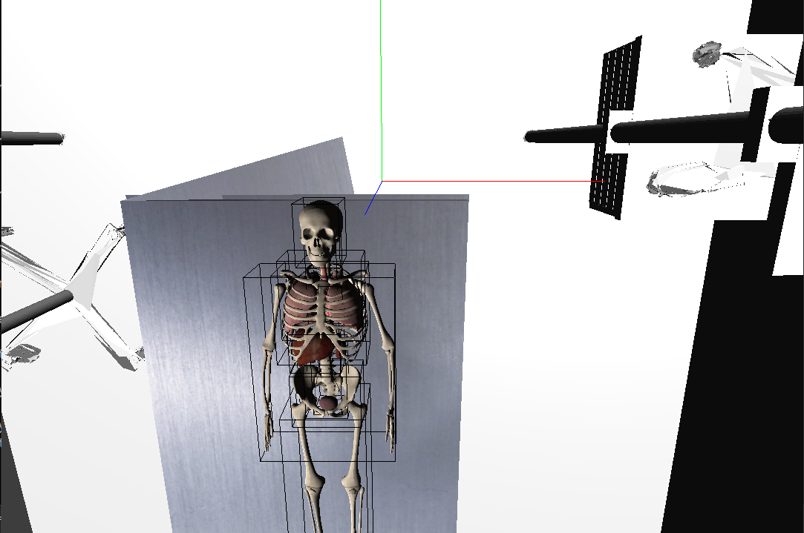

# Medical Simulation
This project  focused on enhancing a virtual medical simulation designed to depict interactions with medical tools and human organs.
It uses the Glitter project as a starting point. 

The primary objective of this project is to develop a comprehensive VR medical simulation system that is capable of providing a realistic and immersive experience for medical students. 

To achieve this goal, I have implemented a number of features and components, to the shader, model, camera, and mesh classes. 
These components are designed to also allowing for easy customization and scalability. 

Furthermore, I have also implemented a number of optimization techniques to ensure that the simulation runs smoothly and efficiently.

## Dependencies

| Functionality             | Library  |
|--------------------------|----------|
| Mesh Loading             | [assimp](https://github.com/assimp/assimp)  |
| Physics                  | [bullet](https://github.com/bulletphysics/bullet3)   |
| OpenGL Function Loader   | [glad](https://github.com/Dav1dde/glad)    |
| Windowing and Input      | [glfw](https://github.com/glfw/glfw)    |
| OpenGL Mathematics       | [glm](https://github.com/g-truc/glm)|
| Texture Loading          | [stb](https://github.com/nothings/stb)|

## TODO
- Integrate the physics
- Add Entity class 